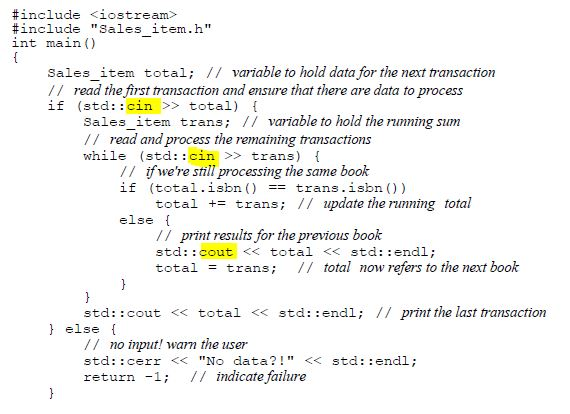

# function

- function
    - can have default arguments
    - may not defined in a function

# lambda

- lambda
    - may not have default arguments
    - may be defined inside a function


```c++
    [](const string &a, const string &b){ return a.size() < b.size()>}
    //words -> container
    stable_sort(words.begin(), words.end(),
    [](const string &a, const string &b){return a.size()< b.size();});

```
[capture list](parameter list){function body}
- capture list is used for local nonstatic variables (e.g. defined in surrounding function.)
    - [=] , implicitly captured by value
    - [&] , implicitly captured by reference
    - [&,c], implicitly captured by reference except variable c explicitly captured by value
    - [=,&os], implicitly captured by value except os implicitly captured by reference

- mutable lambda
    - default lambda may not change the value of a variable that it copies by value
    - if to change the value of captured variable, must follow the parameter list with keyword mutable

```c++

    void fn(){
        size_t a = 43;
        auto f = [a]() mutable {return ++a}
    }
```

- specifying lambda return type in case of more than single return

```c++

    //single return type

    //return type can be inferred
    [](int i){ return i<0 ? -i : i ;};

    //compile error because cannot deduce return type
    [](int i){if (i<0) return -i; else return i;};

    //need to define a return type(trailing return type)
    [](int i)-> int{if (i<0) return -i; else return i;};
```

# binding arguments

- bind() , from functional header

```c++

    bool check_size(const string &s, string::size_type sz)
    {
        return s.size() > =sz;
    }

    // use lambda in find_if algorithm
    find_if(words.begin(), words.end(), [sz](const string &s){return s.size()>=sz};);

    // can't use check_size as find_if predicate because the callable needs to be unary predicate(check_size takes in two arguments)

    // use bind from functional header
    // bind() returns a callable that takes in one parameter(signify by _1)
    // _1,_2 are parameters of the newcallable
    // _1 will fulfil 1st argument of check_size
    // sz will fulfil the 2nd argument of check_size
    // _1 defined in namespace placeholders, which is defined in namespace std
    using std::placeholders::_1
    using namespace std::placeholders // making all names defined by placeholders usable
    
    find_if(words.begin(), words.end(), bind(check_size, _1, sz));
```

# iterator header

```c++
 #include <iterator>
```
## insert iterators
    - back_inserter()   , create iterator using container push_back
    - front_inserter() , create iterator using container push_front
    - inserter()    , create iterator using container insert

```c++
    //copy algorithm header
    list<int> lst{1,2,3,4};
    list<int> lst2, lst3;
    copy(lst.cbegin(), lst.cend(), front_inserter(lst2));
    copy(lst.cbgin(), lst.cend(), inserter(lst3, lst3.begin()));
```

## stream iterators

    
### istream_iterator from iterator header
```c++
    //#include <iterator>

    istream_iterator<int> in_iter(cin); //in_iter is iterator for cin that reads int type
    istream_iterator<int> in_eof;
    while(in_iter != in_eof)
        vec.push_back(*in_iter++);
```
```c++

    istream_iterator<int> in_iter(cin), eof; 
    vector<int> ivec(in_iter, eof); //construct vector from an iterator range
```
- stream iterators with algorithm
```c++

    istream_iterator<int> in_iter(cin), eof;
    cout<<accumulate(in_iter, eof, 0)<<endl;
```
### ostream_iterator for iterator header

```c++

    ostream_iterator<int> out_iter(cout," "); //optional 2nd argument to print a char string following each element
    for (auto e: vec){
        *out_iter++ = e;
    }
```
```c++
    copy(vec.begin(), vec.end(), out_iter); 
    //copy algorithm
    //third argument is an iterator to destination 
```
- using stream iterators with class types
    - before
        - 
    - after
        - 

    - ex10.3.2 solution
        - 


## reverse iterators
## move iterators

