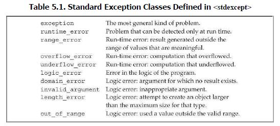

/*throw*/

#include <stdexcept> 
// runtime_error is one of the standard
//library exception types and is defined in stdexcept header

 throw runtime_error("Error!") 
 //throwing an exception will terminate the current function and //transfer control to a handler that will know how to handle this //error. 
 //must initialise runtime_error with a string or C-style   
 //character string. provides additional info about error.

 /*try .....catch......*/

 try{

 } catch(runtime_error err){ 
     cout<<err.what()>>
 }

 //err has type runtime_error
 //what() is member function of runtime_error class
 //what() returns C-style char string

 /*Standard exceptions*/

 1) exception header
    e.g. exception
 2) stdexcept header //#include <stdexcept>
    
 3) new header 
    e.g. bad_alloc
 4) type_info header
    e.g. bad_cast
