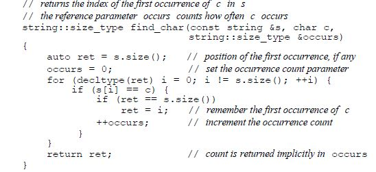

# manage array arguments in a function

1) string pointer where last character is not a null
```
void print(const char *cp){
    if(cp){
        while(*cp) cout<<*cp++;
    }
}
```

2) using begin(array) and end(array)
```
void print(const int *beg, const int *end){
    while (beg != end)
        cout<< *beg++<<end;
}
```

int j[2] = {0,1};
print(begin(j), end(j));

3) Similar to (2) but using size instead
```
void print(const int ia[], size_t size){
    for(size_t i=0; i != size; i++){
        cout<<ia[i]<<endl;>>
    }
}
```

int j[] = {0,1};
print(j, end(j) - begin(j));

4) by reference
```
void print(int (&arr)[10]){
    for (auto elem : arr)
        cout<<elem<<endl;
}
```

# initializer_list (ex627, ex628, ex629)

- include <initializer_list> 
- like vector, initializer_list is template type.
- unlike vector, initializer_list are always const values.
- like vector, has begin and end members.


- initializer_list<string> ls;
- initializer_list<int> li;


# function that returns a pointer to an array

1) e.g. int (*func(int i)) [10]
2) alternatively, using pointer(->)
    - e.g. auto func(int i) -> int(*)[10]
3) alternative, possible to use decltype

```
    int odd[] = {1,3,5,7,9}; 
    int even[] = {2,4,6,8,10}; 
    decltype(odd) *arrPtr(int i){ 
        return (i%2) ? &odd : &even;
    }
```