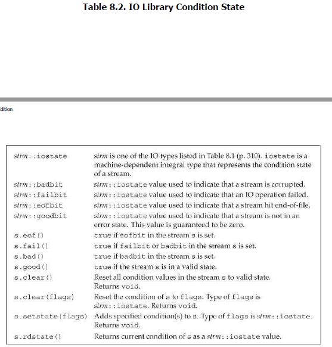
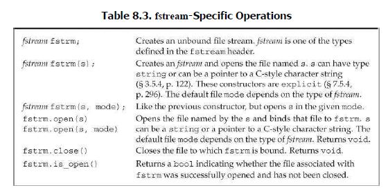
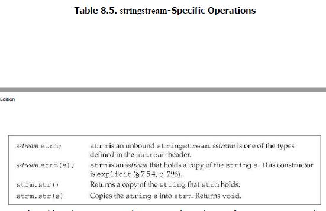

# plain , file, string stream

1) iostream
    - istream, wistream
        - w(wide characters)
    - ostream, wostream
    - iostream, wiostream

2) fstream
    - ifstream, wifstream
        - inheritance from istream class
    - ofstream, wofstream
        - inheritance from ostream class
    - fstream, wfstream

3) sstream
    - istringstream, wistringstream
        - inheritance from istream class
    - ostringstream, wostringstream
        - inheritance from ostream class
    - stringstream, wstringstream

