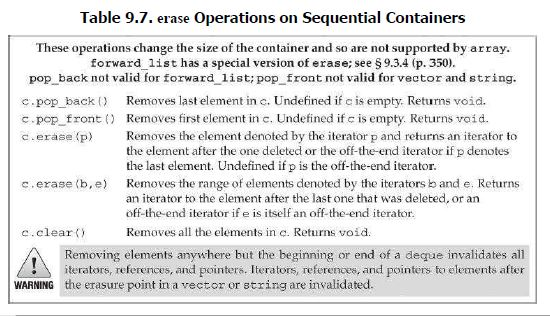

# Add elements to sequential container

# Accessing elements in sequential container

# Erase elements in sequential container

# Insert or remove elements in forward_list

# Resize sequential container

# Memory management for vector, string

# string
## Additional ways to construct string

##  substring function

## Modify Strings (note: additional constructor method by insert and erase)

